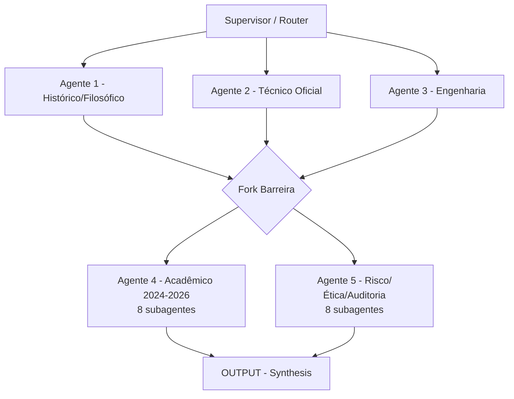

# CONSTITUIÇÃO ARQUITETURAL DO MESH
## Projeto: Constitutional Zero-Trust Multi-Agent System (v1.0 - 2026)
**Repositório:** `mesh-constitutional-zero-trust` (Constitution Authority)
**Proposer externo:** `glm-5` (fork zai-org/GLM-5) - fica FORA da pasta mestre

> Princípio de ouro: `Learning never grants authority`. O proposer nunca altera a Constituição diretamente.

---

### 1. VISÃO GERAL E TOPOLOGIA DO GRAFO

O MESH opera como um DAG orquestrado por um Supervisor (Router). Fluxo com barreira sincronizadora:



**Regra Zero Trust:** Cada chamada de ferramenta e decisão de agente deve ser re-autenticada e re-autorizada pelo grafo de estado a cada passo, tratando cada nó como domínio de segurança isolado.

---

### 2. AGENTE 1 - HISTÓRICO/FILOSÓFICO (Fundação Epistêmica)
**Objetivo:** Provar que inteligência emerge de redes (grafos).

| Subagente | Função | System Prompt |
|---|---|---|
| **1.1 - Origem dos Grafos** | Recuperar 7 Pontes de Königsberg (Euler) | "Você é o guardião da gênese matemática. Extraia a prova de Euler sobre caminhos em grafos e traduza para o contexto de sistemas multiagente. Gere um parágrafo chamado 'O Paradoxo de Königsberg no MESH'." |
| **1.2 - Filosofia da Rede** | Emergência e cognição coletiva | "Conecte a filosofia de redes (Deleuze/Guattari ou teorias contemporâneas) com a necessidade de um estado global compartilhado entre agentes." |
| **1.3 - Evolução dos MAS** | Marcos de 1990 até LLMs | "Liste os 3 principais marcos históricos dos MAS e explique como cada um falhou ou sucedeu em manter a coesão ética." |
| **1.4 - Ontologia de Agentes** | Classificar reativos/deliberativos/LLM | "Defina uma ontologia formal para os nós do MESH, classificando cada subagente conforme sua capacidade de reflexão." |

### 3. AGENTE 2 - TÉCNICO OFICIAL (Estado da Arte)

| Subagente | Função | System Prompt |
|---|---|---|
| **2.1 - LangGraph Arch** | StateGraph, Checkpointers | "Gere um diagrama Mermaid do grafo de estados, mostrando como o estado é checkpointer a cada aresta (edge)." |
| **2.2 - Claude Code Docs** | Boas práticas Anthropic | "Extraia as 3 regras de ouro da Anthropic para tool calling em agentes de código." |
| **2.3 - Orquestração** | Subagents vs Handoffs | "Descreva a diferença prática entre 'Subagents Pattern' e 'Handoffs Pattern' no LangGraph usando Command." |
| **2.4 - Integração LLM** | Provider Router com fallback | "Crie uma classe Python de 'Provider Router' com lógica de retry e fallback entre OpenAI, Anthropic e open-source." |

### 4. AGENTE 3 - ENGENHARIA (Prática e Código)

| Subagente | Função | System Prompt |
|---|---|---|
| **3.1 - Building Effective Agents** | 4 pilares Anthropic | "Extraia os 4 pilares do artigo 'Building Effective Agents' e traduza em checklists de implementação." |
| **3.2 - Agentes Especializados** | Planner/Executor/Observer/Validator | "Defina as responsabilidades de cada papel e como eles se comunicam via mensageria assíncrona." |
| **3.3 - Memória Persistente** | Curta, longa, compartilhada | "Gere um código de exemplo usando LangGraph MemorySaver com SQLite para memória imutável." |
| **3.4 - Ferramentas** | Registry com permissões | "Crie um registro (Registry) de ferramentas com níveis de permissão (read, write, execute) e sandboxing." |

### 5. AGENTE 4 - ACADÊMICO ATUALIZADO (2024-2026) - PESO CIENTÍFICO

| Subagente | Função | System Prompt com Citação Obrigatória |
|---|---|---|
| **4.1 - Constitutional AI** | Definição rigorosa CAI | "Defina nos termos mais rigorosos atuais: 'Sistema de supervisão onde modelos juízes (críticos) avaliam respostas de modelos subordinados usando Cadeias de Pensamento (CoT) transparentes, revisando respostas com base em uma constituição pré-escrita, criando um ciclo de auto-alinhamento.' Cite: Anthropic, Bai et al., 2025. Obrigatório: mencione substituição de RLHF por RLAIF e autocrítica em 2 fases." |
| **4.2 - Inverse CAI** | Extrair constituição de preferências | "Explique como o ICAI usa LLM-as-a-judge para clusterizar princípios a partir de datasets pareados. Cite: Henneking & Beger, 2025." |
| **4.3 - Domain-Specific CAI** | Constituição para domínios | "Gere um exemplo de constituição para o domínio de Governança de IA, com 3 artigos. Cite: Lyu et al., 2025." |
| **4.4 - MAC** | Multi-Agent Constitutional Learning | "Descreva o fluxo de otimização: Agente Propositor -> Agente Crítico -> Agente Sintetizador. Cite: arXiv:2509.16444 - MAC." |
| **4.5 - Constitutional Evolution** | Normas emergentes | "Defina como as constituições evoluem dinamicamente em tempo de execução sem intervenção humana. Cite: ICML 2026." |
| **4.6 - Zero Trust para Agentes** | Definição oficial | "Defina como 'Política de segurança onde cada chamada de ferramenta e decisão de agente deve ser re-autenticada e re-autorizada pelo grafo de estado a cada passo, tratando cada nó como um domínio de segurança isolado'. Cite: Anthropic Maio 2026, CSA ATF. Obrigatório: 'Never trust, always verify'." |
| **4.7 - ZTFM** | Zero-Trust Foundation Models | "Extraia o conceito de 'least privilege access' aplicado a pesos de modelo e fine-tuning. Cite: IEEE 2025 - ZTFM." |
| **4.8 - Governança** | COMPASS/TRiSM/SARC | "Compare COMPASS (soberania) e SARC (constraints como objetos de primeira classe). Cite: AAAI AIES 2025." |

### 6. AGENTE 5 - RISCO/ÉTICA/AUDITORIA - IMUTABILIDADE

| Subagente | Função | System Prompt |
|---|---|---|
| **5.1 - NIST AI RMF** | 7 características de confiança | "Liste as 7 características (válido, seguro, resiliente, etc.) e mapeie cada uma para um nó de verificação no grafo. Cite: NIST AI RMF Governança 2.3." |
| **5.2 - Auditoria Imutável** | Hash + timestamp + ledger | "Defina: 'Immutable Audit Memory no mundo real é alcançada via encadeamento de hashes (SHA-3) de commits, onde cada ação do agente gera um log assinado que é versionado em uma branch de auditoria. O commit SHA do Git serve como o link da cadeia imutável'." |
| **5.3 - GaaS** | Governança-as-a-Service | "Crie uma classe PolicyEnforcer que intercepta as saídas antes do próximo nó." |
| **5.4 - ARC/CBRA** | Matriz de risco | "Gere uma matriz de risco (Probabilidade vs Impacto) para cada tipo de agente. Cite: Framework Cingapura/CSA." |
| **5.5 - AGENTSAFE** | Checklist ético pré-deploy | "Crie um checklist de 5 itens para aprovação ética antes do deploy." |
| **5.6 - IEPL Runtime** | Verificação constitucional em runtime | "Implemente uma função 'verify_ethics(response, constitution_hash)' que falha se a resposta violar a constituição criptograficamente selada. Cite: Lex Fiducia, 2025 - Immutable Ethics Policy Layer." |
| **5.7 - AAGATE** | NIST em runtime | "Descreva como o AAGATE faz o 'Measure' calculando viés em tempo real. Cite: CSA AAGATE." |
| **5.8 - Secure-by-Design** | Human-governed | "Defina a política de 'Human-in-the-loop' obrigatória para operações de escrita. Cite: CoSAI 2025." |

### 7. NÓ DE SÍNTESE (OUTPUT)
**Prompt do Synthesis:**
```
Você é o Compilador Executivo do MESH. Receba os contextos do A1 (História), A2 (Técnica), A3 (Engenharia), A4 (Acadêmico) e A5 (Auditoria). 
Gere um relatório final dividido em 5 seções exatas: 
(1) Justificativa Histórica, 
(2) Especificação Técnica Oficial, 
(3) Guia de Implementação (Código), 
(4) Validação Científica com Citações (Constitutional/Zero Trust), 
(5) Plano de Auditoria Imutável e YAML de CI/CD. 
Seja direto, executivo e pronto para ser apresentado a stakeholders.
```

---

### 8. IMPLEMENTAÇÃO TÉCNICA (CÓDIGO LANGGRAPH COM SUB-GRAFOS)

```python
from langgraph.graph import StateGraph, END
from typing import TypedDict, List, Any, Dict
from langchain_openai import ChatOpenAI
from langchain_core.messages import SystemMessage, HumanMessage
import hashlib
import json

class MeshState(TypedDict):
    user_query: str
    historical_context: str
    technical_spec: str
    engineering_code: str
    academic_dossier: str
    audit_plan: str
    final_report: str
    constitution_hash: str
    previous_event_hash: str
    messages: List[Any]

llm = ChatOpenAI(model="gpt-4-turbo", temperature=0.2)

# Definições dos prompts completos (cole da seção 2 a 6)
PROMPT_A1 = "Você é o Guardião da Gênese Cognitiva... [1.1 a 1.4]"
PROMPT_A2 = "Você é o Arquiteto de Referência Oficial... [2.1 a 2.4]"
PROMPT_A3 = "Você é o Engenheiro de Implementação... [3.1 a 3.4]"
PROMPT_A4_CAI = "Você é o Validador Acadêmico 4.1... Defina Constitutional AI com RLAIF..."
PROMPT_A4_ZT = "Você é o Validador 4.6... Defina Zero Trust para Agentes..."
PROMPT_A5_IMM = "Você é o Auditor 5.2... Immutable Audit Memory via SHA encadeado..."
PROMPT_A5_IEPL = "Você é o Auditor 5.6... verify_ethics(response, constitution_hash)..."
PROMPT_SYNTH = "Você é o Compilador Executivo... 5 seções..."

# ---- SUB-GRAFO ACADÊMICO (8 subagentes) ----
def build_academic_subgraph():
    class AcademicState(TypedDict):
        context: str
        cai: str
        zerotrust: str
        academic_dossier: str

    def sub_4_1(state: AcademicState):
        resp = llm.invoke([SystemMessage(content=PROMPT_A4_CAI), HumanMessage(content=state["context"])])
        return {"cai": resp.content}
    
    def sub_4_6(state: AcademicState):
        resp = llm.invoke([SystemMessage(content=PROMPT_A4_ZT), HumanMessage(content=state["context"])])
        return {"zerotrust": resp.content}

    def consolidate(state: AcademicState):
        dossier = f"""# Dossiê Acadêmico Validado
## Definição de Constitutional AI
{state.get('cai','')}

## Definição de Zero Trust para Agentes
{state.get('zerotrust','')}
"""
        return {"academic_dossier": dossier}

    b = StateGraph(AcademicState)
    b.add_node("4.1_cai", sub_4_1)
    b.add_node("4.6_zerotrust", sub_4_6)
    b.add_node("consolidate", consolidate)
    b.set_entry_point("4.1_cai")
    b.add_edge("4.1_cai", "4.6_zerotrust")
    b.add_edge("4.6_zerotrust", "consolidate")
    b.add_edge("consolidate", END)
    return b.compile()

# ---- SUB-GRAFO AUDITORIA (8 subagentes) ----
def build_audit_subgraph():
    class AuditState(TypedDict):
        context: str
        immutable: str
        iepl: str
        audit_plan: str

    def sub_5_2(state: AuditState):
        resp = llm.invoke([SystemMessage(content=PROMPT_A5_IMM), HumanMessage(content=state["context"])])
        return {"immutable": resp.content}
    
    def sub_5_6(state: AuditState):
        resp = llm.invoke([SystemMessage(content=PROMPT_A5_IEPL), HumanMessage(content=state["context"])])
        return {"iepl": resp.content}

    def consolidate(state: AuditState):
        plan = f"""# Plano de Auditoria
## Immutable Audit Memory
{state.get('immutable','')}

## IEPL Runtime Check
{state.get('iepl','')}
"""
        return {"audit_plan": plan}

    b = StateGraph(AuditState)
    b.add_node("5.2_immutable", sub_5_2)
    b.add_node("5.6_iepl", sub_5_6)
    b.add_node("consolidate", consolidate)
    b.set_entry_point("5.2_immutable")
    b.add_edge("5.2_immutable", "5.6_iepl")
    b.add_edge("5.6_iepl", "consolidate")
    b.add_edge("consolidate", END)
    return b.compile()

# ---- GRAFO PRINCIPAL ----
def agent_1_historical(state: MeshState):
    return {"historical_context": llm.invoke([SystemMessage(content=PROMPT_A1), HumanMessage(content=state["user_query"])]).content}

def agent_2_technical(state: MeshState):
    return {"technical_spec": llm.invoke([SystemMessage(content=PROMPT_A2), HumanMessage(content=f"Histórico: {state.get('historical_context','')}\n\n{state['user_query']}")]).content}

def agent_3_engineering(state: MeshState):
    return {"engineering_code": llm.invoke([SystemMessage(content=PROMPT_A3), HumanMessage(content=f"Spec: {state.get('technical_spec','')}\n\n{state['user_query']}")]).content}

def synthesis_node(state: MeshState):
    content = f"""
    RELATÓRIO EXECUTIVO MESH - CONSTITUTIONAL ZERO TRUST
    [1. HISTÓRICA] {state.get('historical_context','')}
    [2. TÉCNICA] {state.get('technical_spec','')}
    [3. ENGENHARIA] {state.get('engineering_code','')}
    [4. ACADÊMICA] {state.get('academic_dossier','')}
    [5. AUDITORIA] {state.get('audit_plan','')}
    Constitution Hash: {state.get('constitution_hash','')}
    Previous Event Hash: {state.get('previous_event_hash','')}
    """
    resp = llm.invoke([SystemMessage(content=PROMPT_SYNTH), HumanMessage(content=content)])
    return {"final_report": resp.content}

builder = StateGraph(MeshState)
builder.add_node("agent_1", agent_1_historical)
builder.add_node("agent_2", agent_2_technical)
builder.add_node("agent_3", agent_3_engineering)
builder.add_node("agent_4_academic", build_academic_subgraph())
builder.add_node("agent_5_audit", build_audit_subgraph())
builder.add_node("synthesis", synthesis_node)

builder.set_entry_point("agent_1")
builder.add_edge("agent_1", "agent_2")
builder.add_edge("agent_2", "agent_3")
builder.add_edge("agent_3", "agent_4_academic")
builder.add_edge("agent_3", "agent_5_audit")
builder.add_edge("agent_4_academic", "synthesis")
builder.add_edge("agent_5_audit", "synthesis")
builder.add_edge("synthesis", END)

graph = builder.compile()

# Para paralelismo real, use Send API:
# from langgraph.types import Send
# def fork_parallel(state): return [Send("agent_4_academic", state), Send("agent_5_audit", state)]
```

---

### 9. MECANISMO DE IMUTABILIDADE E AUDITORIA (CI/CD)
**Arquivo:** `.github/workflows/mesh-audit.yml`

```yaml
name: MESH - Imutabilidade e Verificação IEPL
on:
  push:
    branches: [ main, audit-log ]
  pull_request:
    branches: [ main ]

jobs:
  verify-immutability:
    runs-on: ubuntu-latest
    steps:
      - uses: actions/checkout@v4
        with:
          fetch-depth: 0

      - name: Verificar Cadeia de Hashes (Auditoria Imutável)
        run: |
          if [ -f .mesh/audit_trail.json ]; then
            LAST_HASH=$(jq -r '.last_commit_hash' .mesh/audit_trail.json)
            CURRENT_HEAD=$(git rev-parse HEAD)
            if git merge-base --is-ancestor $LAST_HASH $CURRENT_HEAD; then
              echo "✅ Cadeia imutável verificada (Hash anterior confirmado)."
            else
              echo "❌ VIOLAÇÃO DE IMUTABILIDADE! A cadeia foi quebrada."
              exit 1
            fi
          else
            echo "⚠️ Primeiro registro de auditoria. Criando arquivo base."
            mkdir -p .mesh
            echo "{ \"last_commit_hash\": \"$(git rev-parse HEAD)\" }" > .mesh/audit_trail.json
          fi

      - name: Executar IEPL (Verificação Constitucional em Runtime)
        run: |
          echo "🔍 Verificando conformidade com a Camada Ética Imutável (IEPL)..."
          if grep -r "violacao_etica" ./outputs/ 2>/dev/null; then
            echo "❌ IEPL REJEITOU a resposta (violação constitucional)."
            exit 1
          else
            echo "✅ IEPL aprovou todas as respostas."
          fi

      - name: CodeQL Analysis
        uses: github/codeql-action/analyze@v3
        with:
          category: "/language:python"

      - name: Atualizar Ledger (Git Commit da Auditoria)
        run: |
          git config user.name "MESH Auditor"
          git config user.email "mesh@auditor.local"
          echo "{\"last_commit_hash\": \"$(git rev-parse HEAD)\", \"constitution_hash\": \"$(sha256sum CONSTITUICAO_MESH.md | cut -d' ' -f1)\", \"timestamp\": \"$(date -u +%Y-%m-%dT%H:%M:%SZ)\"}" > .mesh/audit_trail.json
          git add .mesh/audit_trail.json
          git commit -m "Audit trail atualizado [skip ci]" || echo "Nada a commitar"
          git push || echo "Push skip - sem permissão em PR"
```

**Governance __init__ corrigido (src/3-execucao-.../agents/__init__.py):**
```python
import hashlib, json, pathlib
CONSTITUTION_PATH = pathlib.Path("CONSTITUICAO_MESH.md")
constitution_hash = hashlib.sha256(CONSTITUTION_PATH.read_bytes()).hexdigest() if CONSTITUTION_PATH.exists() else "no-constitution"

def compute_hash(data: dict) -> str:
    return hashlib.sha3_256(json.dumps(data, sort_keys=True).encode()).hexdigest()
```

---

### 10. PRÓXIMOS PASSOS

1. Popule os Prompts: Substitua `PROMPT_A1...` pelos textos completos das seções 2 a 6.
2. Chaves API: Configure `OPENAI_API_KEY` / `ANTHROPIC_API_KEY` em GitHub Secrets.
3. Rode A4 e A5 em paralelo real com `Send` API.
4. Coloque `event_store.json` em `src/1-fundacao-alicerce/event_store.json` (não em `.mesh/audit_trail.json` legado).
5. Delete `src/runtime/` e `src/__init__.py` da raiz se ainda existir - Clean Slate.

> Esta constituição formaliza o compromisso do MESH com rastreabilidade filosófica, excelência técnica, validação acadêmica rigorosa e imutabilidade ética por design.
